# Especificação do Protocolo MQTT -  Sistema RR Rural Fermentation

## 📋 Visão Geral

Este documento descreve a especificação completa do protocolo MQTT utilizado no  Sistema RR Rural Fermentation para monitoramento de fermentação ruminal in vitro.

## 🏗️ Arquitetura de Tópicos

### Estrutura Hierárquica

```
rumen/
├── {assay_id}/
│   ├── control/
│   │   ├── start
│   │   └── stop
│   └── {flask_id}/
│       ├── telemetry
│       ├── alert
│       └── config
└── system/
    ├── status
    └── broadcast
```

### Convenções de Nomenclatura

- **assay_id**: Identificador único do ensaio (ex: RF001, RF002)
- **flask_id**: Identificador do frasco (ex: 01, 02, 03, 04)
- **Formato**: Sempre minúsculas, separadas por hífen
- **Timestamp**: Unix timestamp em milissegundos

## 📡 Tópicos e Mensagens

### 1. Telemetria (Telemetry)

**Tópico**: `rumen/{assay_id}/{flask_id}/telemetry`

**Descrição**: Dados de telemetria enviados periodicamente pelos sensores

**Frequência**: A cada 5 minutos (configurável)

**QoS**: 1 (Entrega garantida pelo menos uma vez)

**Payload JSON**:
```json
{
  "timestamp": 1705324800000,
  "assay_id": "RF001",
  "flask_id": "01",
  "pressure": 1.234,
  "temperature": 39.2,
  "normalized_pressure": 1.198,
  "accumulation_rate": 0.045,
  "status": "normal",
  "sequence": 1234,
  "battery": 85.5,
  "rssi": -67
}
```

**Campos**:
- `timestamp`: Unix timestamp em milissegundos
- `assay_id`: ID do ensaio (string)
- `flask_id`: ID do frasco (string)
- `pressure`: Pressão absoluta em bar (float)
- `temperature`: Temperatura em Celsius (float)
- `normalized_pressure`: Pressão normalizada para 39°C (float)
- `accumulation_rate`: Taxa de acumulação em mL/h (float)
- `status`: Status do sistema (string: "normal", "warning", "critical")
- `sequence`: Número de sequência para detecção de perdas (integer)
- `battery`: Nível da bateria em % (float, 0-100)
- `rssi`: Força do sinal WiFi em dBm (float)

### 2. Alertas (Alert)

**Tópico**: `rumen/{assay_id}/{flask_id}/alert`

**Descrição**: Mensagens de alerta para condições anormais

**QoS**: 2 (Entrega garantida exatamente uma vez)

**Payload JSON**:
```json
{
  "timestamp": 1705324800000,
  "assay_id": "RF001",
  "flask_id": "01",
  "alert_type": "overpressure",
  "severity": "critical",
  "message": "Pressão crítica detectada: 1.67 bar",
  "current_value": 1.67,
  "threshold": 1.5,
  "recommended_action": "Verificar válvula de alívio",
  "auto_resolved": false,
  "alert_id": "alert_1234567890"
}
```

**Tipos de Alerta**:
- `overpressure`: Sobrepressão detectada
- `temperature_high`: Temperatura alta
- `temperature_low`: Temperatura baixa
- `sensor_failure`: Falha do sensor
- `pressure_relief`: Alívio de pressão automático
- `battery_low`: Bateria baixa
- `communication_loss`: Perda de comunicação

**Severidades**:
- `info`: Informação geral
- `warning`: Atenção necessária
- `critical`: Ação imediata requerida

### 3. Configuração (Config)

**Tópico**: `rumen/{assay_id}/{flask_id}/config`

**Descrição**: Configurações do dispositivo e parâmetros operacionais

**QoS**: 1 (Entrega garantida pelo menos uma vez)

**Payload JSON (Request)**:
```json
{
  "timestamp": 1705324800000,
  "assay_id": "RF001",
  "flask_id": "01",
  "config_type": "update",
  "parameters": {
    "pressure_threshold": 1.5,
    "temperature_min": 38.0,
    "temperature_max": 40.0,
    "telemetry_interval": 300,
    "auto_relief_enabled": true,
    "relief_threshold": 1.4,
    "calibration_offset": 0.02
  },
  "request_id": "req_1234567890"
}
```

**Payload JSON (Response)**:
```json
{
  "timestamp": 1705324800000,
  "assay_id": "RF001",
  "flask_id": "01",
  "config_type": "response",
  "status": "success",
  "applied_config": {
    "pressure_threshold": 1.5,
    "temperature_min": 38.0,
    "temperature_max": 40.0,
    "telemetry_interval": 300,
    "auto_relief_enabled": true,
    "relief_threshold": 1.4,
    "calibration_offset": 0.02
  },
  "request_id": "req_1234567890",
  "response_code": 200
}
```

### 4. Controle do Ensaio (Control)

#### Iniciar Ensaio

**Tópico**: `rumen/{assay_id}/control/start`

**Descrição**: Inicia um novo ensaio experimental

**QoS**: 2 (Entrega garantida exatamente uma vez)

**Payload JSON**:
```json
{
  "timestamp": 1705324800000,
  "assay_id": "RF001",
  "initiated_by": "user_123",
  "parameters": {
    "num_flasks": 4,
    "duration_hours": 48,
    "sample_description": "Capim Napier - 500mg MS",
    "target_temperature": 39.0,
    "pressure_limit": 1.5,
    "telemetry_interval": 300
  },
  "flask_configs": {
    "01": { "sample_weight": 500.0, "treatment": "controle" },
    "02": { "sample_weight": 500.0, "treatment": "aditivo_A" },
    "03": { "sample_weight": 500.0, "treatment": "aditivo_B" },
    "04": { "sample_weight": 500.0, "treatment": "aditivo_C" }
  },
  "control_id": "ctrl_start_1234567890"
}
```

#### Parar Ensaio

**Tópico**: `rumen/{assay_id}/control/stop`

**Descrição**: Finaliza um ensaio em andamento

**QoS**: 2 (Entrega garantida exatamente uma vez)

**Payload JSON**:
```json
{
  "timestamp": 1705324800000,
  "assay_id": "RF001",
  "initiated_by": "user_123",
  "reason": "Finalizado com sucesso - 48h completas",
  "final_status": "completed",
  "summary": {
    "start_time": 1705300000000,
    "duration_hours": 48.5,
    "total_readings": 582,
    "alerts_generated": 3,
    "auto_reliefs": 12
  },
  "control_id": "ctrl_stop_1234567890"
}
```

### 5. Status do Sistema (System)

**Tópico**: `rumen/system/status`

**Descrição**: Status geral do sistema e heartbeat

**Frequência**: A cada 60 segundos

**QoS**: 0 (Entrega não garantida - fire and forget)

**Payload JSON**:
```json
{
  "timestamp": 1705324800000,
  "system_status": "operational",
  "active_assays": 2,
  "total_flasks": 8,
  "uptime_seconds": 86400,
  "version": "1.0.0",
  "memory_usage": {
    "heap_used": 67108864,
    "heap_total": 134217728,
    "external": 8388608
  },
  "mqtt_stats": {
    "messages_received": 12543,
    "messages_sent": 8765,
    "connected_clients": 8
  },
  "database_stats": {
    "total_readings": 45678,
    "total_alerts": 234,
    "database_size_mb": 12.5
  }
}
```

## 🔐 Segurança e Autenticação

### Credenciais MQTT

```javascript
// Configuração típica do cliente
const mqttOptions = {
  host: 'localhost',
  port: 1883,
  username: 'ankom_rf_user',
  password: 'secure_password_123',
  clientId: 'ankom-rf-backend-001',
  clean: true,
  reconnectPeriod: 5000,
  connectTimeout: 30000,
  will: {
    topic: 'rumen/system/status',
    payload: JSON.stringify({
      timestamp: Date.now(),
      system_status: 'offline',
      message: 'Backend desconectado inesperadamente'
    }),
    qos: 1,
    retain: false
  }
};
```

### TLS/SSL (Recomendado para Produção)

```javascript
// Configuração com TLS
const mqttOptionsTLS = {
  host: 'mqtt.ankom-rf-iot.com',
  port: 8883,
  protocol: 'mqtts',
  username: 'ankom_rf_user',
  password: 'secure_password_123',
  clientId: 'ankom-rf-backend-001',
  ca: fs.readFileSync('./certs/ca.crt'),
  cert: fs.readFileSync('./certs/client.crt'),
  key: fs.readFileSync('./certs/client.key'),
  rejectUnauthorized: true
};
```

## 📊 Formato de Dados

### Validação JSON Schema

#### Telemetria Schema
```json
{
  "$schema": "http://json-schema.org/draft-07/schema#",
  "type": "object",
  "required": ["timestamp", "assay_id", "flask_id", "pressure", "temperature"],
  "properties": {
    "timestamp": { "type": "integer", "minimum": 1600000000000 },
    "assay_id": { "type": "string", "pattern": "^[A-Z0-9]{3,10}$" },
    "flask_id": { "type": "string", "pattern": "^[0-9]{2}$" },
    "pressure": { "type": "number", "minimum": 0, "maximum": 5.0 },
    "temperature": { "type": "number", "minimum": 30, "maximum": 50 },
    "normalized_pressure": { "type": "number", "minimum": 0, "maximum": 5.0 },
    "accumulation_rate": { "type": "number", "minimum": -10, "maximum": 50 },
    "status": { "type": "string", "enum": ["normal", "warning", "critical"] },
    "sequence": { "type": "integer", "minimum": 0 },
    "battery": { "type": "number", "minimum": 0, "maximum": 100 },
    "rssi": { "type": "number", "minimum": -100, "maximum": 0 }
  }
}
```

#### Alert Schema
```json
{
  "$schema": "http://json-schema.org/draft-07/schema#",
  "type": "object",
  "required": ["timestamp", "assay_id", "flask_id", "alert_type", "severity"],
  "properties": {
    "timestamp": { "type": "integer", "minimum": 1600000000000 },
    "assay_id": { "type": "string", "pattern": "^[A-Z0-9]{3,10}$" },
    "flask_id": { "type": "string", "pattern": "^[0-9]{2}$" },
    "alert_type": { 
      "type": "string", 
      "enum": ["overpressure", "temperature_high", "temperature_low", "sensor_failure", "pressure_relief", "battery_low", "communication_loss"] 
    },
    "severity": { "type": "string", "enum": ["info", "warning", "critical"] },
    "message": { "type": "string", "maxLength": 200 },
    "current_value": { "type": "number" },
    "threshold": { "type": "number" },
    "recommended_action": { "type": "string", "maxLength": 100 },
    "auto_resolved": { "type": "boolean" },
    "alert_id": { "type": "string", "pattern": "^alert_[0-9]{10}$" }
  }
}
```

## 🔄 Fluxos de Mensagens

### 1. Ciclo de Vida de um Ensaio

```mermaid
sequenceDiagram
    participant C as Cliente
    participant M as MQTT Broker
    participant B as Backend
    participant D as Dispositivo
    
    C->>M: Publicar start em control/start
    M->>B: Notificar início do ensaio
    B->>D: Enviar configurações
    D->>M: Publicar telemetria periódica
    M->>B: Processar dados
    D->>M: Publicar alertas quando necessário
    M->>B: Processar alertas
    C->>M: Publicar stop em control/stop
    M->>B: Notificar fim do ensaio
```



### 2. Fluxo de Configuração

```mermaid
sequenceDiagram
    participant C as Cliente
    participant M as MQTT Broker
    participant D as Dispositivo
    
    C->>M: Publicar config request
    M->>D: Encaminhar configuração
    D->>M: Publicar config response
    M->>C: Entregar resposta
```



## 📈 Métricas e Monitoramento

### Métricas Recomendadas

```javascript
// Estatísticas de mensagens
const messageStats = {
  totalMessages: 12543,
  messagesPerMinute: 8.5,
  averageMessageSize: 256, // bytes
  errorRate: 0.001, // 0.1%
  duplicateRate: 0.02, // 2%
  
  // Por tipo de mensagem
  telemetryMessages: 8765,
  alertMessages: 234,
  controlMessages: 45,
  configMessages: 89
};

// Qualidade do serviço
const qualityMetrics = {
  messageDeliveryRate: 0.999, // 99.9%
  averageLatency: 15, // ms
  maxLatency: 250, // ms
  connectionUptime: 0.98, // 98%
  reconnectionCount: 12
};
```

## ⚠️ Tratamento de Erros

### Códigos de Erro Padrão

```json
{
  "error_codes": {
    "MQTT_001": "Connection refused - invalid client ID",
    "MQTT_002": "Connection refused - bad username or password",
    "MQTT_003": "Connection refused - not authorized",
    "MQTT_004": "Connection timeout",
    "MQTT_005": "Message too large",
    "MQTT_006": "Invalid topic format",
    "MQTT_007": "QoS not supported",
    "MQTT_008": "Retain not supported",
    "MQTT_009": "Payload validation failed",
    "MQTT_010": "Rate limit exceeded"
  }
}
```

### Exemplo de Tratamento

```javascript
// Tratamento de erros no cliente
mqttClient.on('error', (error) => {
  console.error('MQTT Error:', error);
  
  switch (error.code) {
    case 'ECONNREFUSED':
      console.log('Conexão recusada - verificar credenciais');
      break;
    case 'ENOTFOUND':
      console.log('Host não encontrado - verificar endereço do broker');
      break;
    case 'CONNACK_REFUSED':
      console.log('Autenticação falhou - verificar username/password');
      break;
    default:
      console.log('Erro desconhecido:', error.message);
  }
});

// Tratamento de mensagens inválidas
mqttClient.on('message', (topic, message) => {
  try {
    const data = JSON.parse(message.toString());
    
    // Validar schema
    if (!validateTelemetrySchema(data)) {
      console.error('Mensagem inválida - schema validation failed');
      return;
    }
    
    // Processar mensagem válida
    processTelemetryData(data);
    
  } catch (error) {
    console.error('Erro ao processar mensagem:', error);
  }
});
```

## 🔧 Configurações de Performance

### Parâmetros Otimizados

```javascript
// Configurações para alta performance
const optimizedConfig = {
  // Conexão
  connectTimeout: 30000,
  reconnectPeriod: 1000,
  
  // Buffer
  queueQoSZero: false,
  reschedulePings: true,
  
  // Performance
  fastPingTimeout: 1000,
  keepalive: 60,
  
  // Limpeza
  clean: true,
  clientId: 'ankom-rf-backend-' + Math.random().toString(16).substr(2, 8)
};

// Configurações para ambiente de desenvolvimento
const devConfig = {
  ...optimizedConfig,
  reconnectPeriod: 5000,
  queueQoSZero: true,
  debug: true
};
```

## 📚 Referências

### Padrões e Especificações

- **MQTT 3.1.1 Specification**: http://docs.oasis-open.org/mqtt/mqtt/v3.1.1/
- **MQTT 5.0 Specification**: https://docs.oasis-open.org/mqtt/mqtt/v5.0/
- **JSON Schema**: https://json-schema.org/
- **ISO 8601**: https://www.iso.org/iso-8601-date-and-time-format.html

### Ferramentas Úteis

- **MQTT Explorer**: https://github.com/thomasnordquist/MQTT-Explorer
- **Mosquitto CLI**: https://mosquitto.org/man/mosquitto_pub-1.html
- **MQTT.fx**: http://www.jensd.de/apps/mqttfx/
- **HiveMQ Web Client**: http://www.hivemq.com/demos/websocket-client/

---

**📄 Versão**: 1.0.0 | **📅 Data**: Janeiro 2024 | **✍️ Autor**: Equipe ANKOM RF IoT
